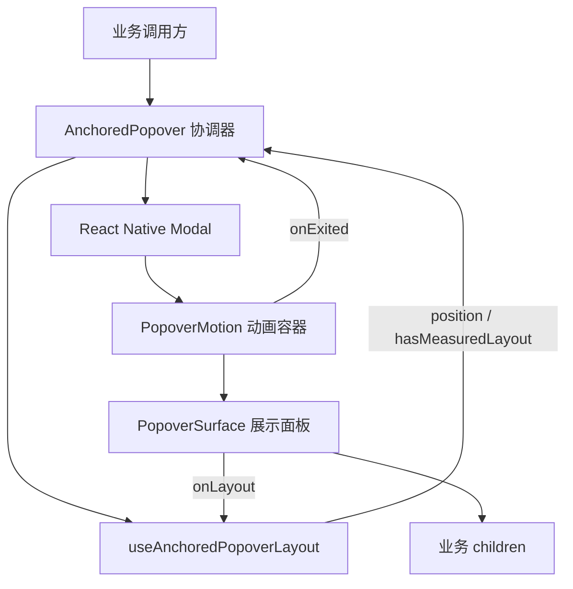
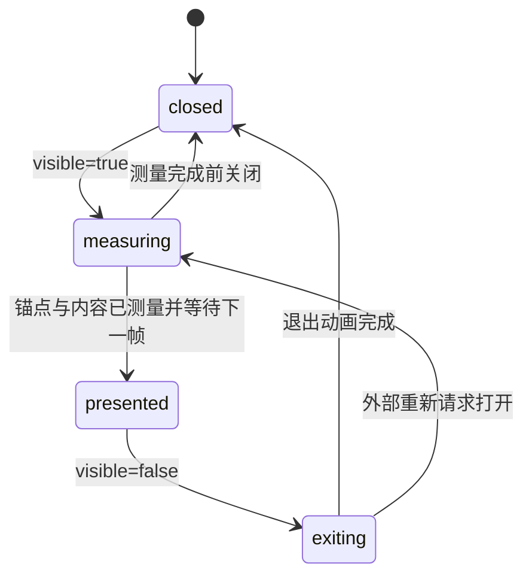
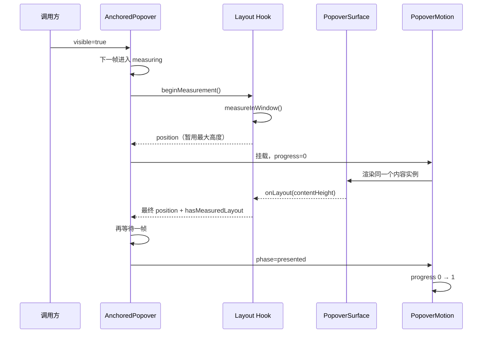

# IRisNote 通用锚点气泡菜单使用与实现详解

> - 文档对应代码快照：2026-08-05
> - 公开组件：`AnchoredPopover`
> - 公开导入路径：`@/shared/ui`
> - 适用环境：Expo SDK 56、React Native 0.85、React Native Reanimated 4.3.1

## 1. 文档目标

本文档同时面向组件使用者和组件维护者，依次回答以下问题：

1. 使用气泡菜单前必须准备哪些值。
2. 每个公开参数有什么作用、约束和默认值。
3. 如何在其他页面中完成一次最小调用。
4. 气泡从点击、测量、展示到退出经历了什么过程。
5. 位置测量、动画、面板渲染和生命周期为什么要拆成不同模块。
6. 当前实现中每个函数体、Effect、回调和计算公式具体做了什么。

本文档解释的是通用 UI 组件，不负责规定字数统计、筛选条件或操作菜单的数据模型。业务页面通过 `children` 自由传入实际内容。

## 2. 组件解决的问题

`AnchoredPopover` 是一个以页面中某个原生视图为锚点的浮层组件。调用方点击按钮后，组件会：

1. 获取锚点在屏幕窗口中的位置和尺寸。
2. 挂载同一个气泡内容实例并以透明状态测量内容高度。
3. 根据安全区、屏幕边距和可用空间选择显示在锚点上方或下方。
4. 将气泡限制在屏幕左右边界内。
5. 计算箭头相对气泡面板的位置，使箭头尽可能指向锚点中心。
6. 在最终位置提交后执行一次进入动画。
7. 响应外部点击和 Android 返回键。
8. 完成退出动画后再卸载原生 `Modal`。

适合的业务场景包括：

- 筛选菜单。
- 排序菜单。
- 单项操作菜单。
- 设置快捷菜单。
- 笔记统计详情。
- 以按钮、图标或标签为锚点的辅助信息面板。

不适合的场景包括：

- 必须占据整个页面的复杂表单。
- 需要拖拽改变高度的底部抽屉。
- 需要路由历史和深链接的独立页面。
- 不依附任何锚点的全屏对话框。

## 3. 使用前必须提供的值

### 3.1 公开属性总表

`AnchoredPopoverProps` 使用 `PropsWithChildren` 定义，因此除了表格中的显式属性，还必须提供业务内容 `children`。

| 属性 | TypeScript 类型 | 必填 | 默认值 | 作用 |
| --- | --- | --- | --- | --- |
| `visible` | `boolean` | 是 | 无 | 表达调用方是否希望气泡处于打开状态。 |
| `anchorRef` | `RefObject<View \| null>` | 是 | 无 | 指向触发按钮或锚点原生视图，用于调用 `measureInWindow`。 |
| `onClose` | `() => void` | 是 | 无 | 接收关闭请求；调用方应在函数内把 `visible` 改为 `false`。 |
| `width` | `number` | 否 | `300` | 期望气泡宽度；屏幕不足时会自动缩小。 |
| `maxHeight` | `number` | 否 | `520` | 期望最大高度；最终还会受锚点上下可用空间限制。 |
| `accessibilityLabel` | `string` | 否 | `"弹出菜单"` | 气泡展示节点的辅助功能名称。 |
| `children` | `ReactNode` | 是 | 无 | 实际菜单、详情或其他业务内容。 |

### 3.2 `visible` 的要求

`visible` 是调用方提供的单一事实来源。组件内部不会私自改变它，只会通过 `onClose` 请求调用方关闭。

正确写法：

```tsx
const [visible, setVisible] = useState(false);

<AnchoredPopover
    visible={visible}
    anchorRef={anchorRef}
    onClose={() => setVisible(false)}
>
    {/* 业务内容 */}
</AnchoredPopover>;
```

调用要求：

- 打开时设置为 `true`。
- `onClose` 最终必须设置为 `false`。
- 不要同时维护 `visible`、`isOpen`、`showPopover` 等多个含义相同的状态。
- 业务层可以增加防重复点击锁，但不能用另一个布尔值代替 `visible`。

### 3.3 `anchorRef` 的要求

`anchorRef` 决定气泡指向哪里。它必须满足以下条件：

- 使用 `useRef<View>(null)` 创建。
- 绑定到真实的 React Native 原生视图，例如 `Pressable` 或 `View`。
- 创建 ref 和使用 ref 的组件必须位于同一稳定生命周期内。
- 打开气泡时锚点仍然挂载在页面上。
- 不能把 ref 绑定到普通函数组件，除非该组件正确转发原生 ref。

正确写法：

```tsx
const anchorRef = useRef<View>(null);

<Pressable ref={anchorRef} onPress={() => setVisible(true)}>
    <Text>打开菜单</Text>
</Pressable>;
```

常见错误：

```tsx
const anchorRef = useRef<View>(null);

// 错误：ref 没有绑定到真正显示在页面上的触发节点。
<Pressable onPress={() => setVisible(true)}>
    <Text>打开菜单</Text>
</Pressable>;
```

如果 ref 没有绑定，`measureInWindow` 不会返回有效坐标，气泡也就无法得到 `position`。

### 3.4 `onClose` 的要求

以下操作都会调用 `onClose`：

- 点击气泡外部的透明区域。
- Android 系统返回键触发 `Modal.onRequestClose`。
- 业务内容主动调用传入的关闭函数。

`onClose` 的最低要求是关闭外部 `visible` 状态：

```tsx
const handleClose = () => {
    setVisible(false);
};
```

业务层可以在关闭时重置菜单页级、临时选择或点击锁，但不要在 `AnchoredPopover` 内加入这些业务逻辑。

### 3.5 `width` 和 `maxHeight` 的要求

两个参数都以 React Native 布局单位传入，应当使用正数。

```tsx
<AnchoredPopover width={280} maxHeight={420} />
```

它们表达的是期望值，不是最终值：

- 最终宽度不超过屏幕宽度减去左右边距。
- 最终高度不超过 `maxHeight`。
- 最终高度还不能超过锚点上方或下方的实际可用空间。
- 内容本身如果更矮，面板使用内容的实际高度。

不建议传入：

- `0` 或负数。
- 明显大于屏幕尺寸的值并期待强制溢出。
- 根据业务内容频繁变化、但没有明确 UI 目的的随机值。

### 3.6 `accessibilityLabel` 的要求

这个值用于描述整个气泡的用途，而不是重复描述触发按钮。

推荐：

```tsx
accessibilityLabel="笔记筛选菜单"
```

不推荐：

```tsx
accessibilityLabel="按钮"
```

测量阶段和退出阶段会从辅助功能树中隐藏，只有 `presented` 阶段允许访问业务内容。

### 3.7 `children` 的要求

`children` 是实际显示结果，可以包含：

- `View`
- `Text`
- `Pressable`
- `ScrollView`
- 自定义业务组件
- 多级菜单内容

当前组件化实现保证同一次打开会话中只挂载一个 `PopoverSurface`。测量阶段和展示阶段不会创建两份并行的 `children`。

仍需遵守以下规则：

- 不要假设测量阶段已经允许点击。
- 不要依赖气泡内部模块的私有类型或状态。
- 业务内容高度变化可以触发重新定位，但不应重新打开气泡。
- 超长内容应自行使用 `ScrollView`，并让 `maxHeight` 约束滚动区域。
- 业务状态应留在调用方或业务组件中。

## 4. 内部值和常量

调用方不需要传入这些值，但理解它们有助于维护组件。

### 4.1 生命周期值

| 名称 | 类型 | 含义 |
| --- | --- | --- |
| `phase` | `"closed" \| "measuring" \| "presented" \| "exiting"` | 当前内部生命周期阶段。 |
| `phaseRef` | `RefObject<PopoverPhase>` 的等价可变引用 | 给异步帧和动画回调读取最新阶段，避免闭包过期。 |
| `lifecycleFrameRef` | `number \| null` | 保存显隐切换使用的下一帧任务编号。 |
| `presentationFrameRef` | `number \| null` | 保存测量完成后切换展示阶段的下一帧任务编号。 |

### 4.2 测量值

| 名称 | 含义 |
| --- | --- |
| `anchorLayout` | 锚点在窗口中的 `x`、`y`、`width`、`height`。 |
| `contentHeight` | 面板内容通过 `onLayout` 得到的高度。 |
| `measurementSessionRef` | 当前打开测量会话编号。新会话或重置时递增。 |
| `measureRequestRef` | 当前具体测量请求编号。重复测量时递增。 |
| `measureFrameRef` | 等待执行的锚点测量帧编号。 |
| `windowSizeRef` | 上一次窗口宽高，用于识别真正的尺寸变化。 |

### 4.3 最终位置值

`PopoverPosition` 包含：

| 字段 | 含义 |
| --- | --- |
| `placement` | `top` 或 `bottom`，表示气泡位于锚点哪一侧。 |
| `left` | 气泡左边缘的窗口坐标。 |
| `top` | 气泡上边缘的窗口坐标。 |
| `width` | 应用屏幕约束后的实际宽度。 |
| `maxHeight` | 应用安全区和可用空间约束后的实际最大高度。 |
| `arrowLeft` | 箭头相对气泡左边缘的位置。 |

### 4.4 动画值

| 名称 | 当前值 | 含义 |
| --- | --- | --- |
| `progress` | `0` 到 `1` | `0` 表示隐藏，`1` 表示完全展示。 |
| `ENTER_DURATION` | `160ms` | 进入动画时长。 |
| `EXIT_DURATION` | `110ms` | 退出动画时长。 |
| `TRANSLATE_DISTANCE` | `12` | 隐藏状态与最终位置之间的纵向距离。 |

### 4.5 布局常量

| 名称 | 来源或值 | 含义 |
| --- | --- | --- |
| `SCREEN_MARGIN` | `spacing.lg` | 气泡与屏幕边缘之间的最小距离。 |
| `ANCHOR_GAP` | `spacing.md` | 气泡与锚点之间的间距。 |
| `POPOVER_ARROW_SIZE` | `spacing.sm` | CSS 三角形箭头的边框尺寸。 |
| `MIN_POPOVER_HEIGHT` | `160` | 判断下方空间是否足够时使用的参考高度。 |

## 5. 在其他页面中的简单调用示例

下面模拟一个页面中的“筛选笔记”按钮。代码只依赖公开的 `AnchoredPopover`，不会导入任何内部模块。

```tsx
import { AnchoredPopover } from "@/shared/ui";
import { useRef, useState } from "react";
import { Pressable, Text, View } from "react-native";

type FilterValue = "all" | "starred" | "recent";

const FILTER_ITEMS: Array<{ label: string; value: FilterValue }> = [
    { label: "全部笔记", value: "all" },
    { label: "已加星标", value: "starred" },
    { label: "最近修改", value: "recent" },
];

export function ExampleFilterPopover() {
    const anchorRef = useRef<View>(null);
    const [visible, setVisible] = useState(false);
    const [selectedFilter, setSelectedFilter] =
        useState<FilterValue>("all");

    const handleSelect = (value: FilterValue) => {
        setSelectedFilter(value);
        setVisible(false);
    };

    return (
        <View className="flex-1 items-center justify-center bg-white">
            <Pressable
                ref={anchorRef}
                accessibilityRole="button"
                accessibilityLabel="打开笔记筛选菜单"
                accessibilityState={{ expanded: visible }}
                onPress={() => setVisible(true)}
                className="rounded-control bg-blue-50 px-4 py-2"
            >
                <Text className="text-sm text-blue-500">筛选笔记</Text>
            </Pressable>

            <AnchoredPopover
                visible={visible}
                anchorRef={anchorRef}
                onClose={() => setVisible(false)}
                width={240}
                maxHeight={280}
                accessibilityLabel="笔记筛选菜单"
            >
                <View className="gap-1 p-2">
                    {FILTER_ITEMS.map((item) => {
                        const selected = item.value === selectedFilter;

                        return (
                            <Pressable
                                key={item.value}
                                accessibilityRole="button"
                                accessibilityState={{ selected }}
                                onPress={() => handleSelect(item.value)}
                                className={
                                    selected
                                        ? "rounded-control bg-blue-50 px-3 py-3"
                                        : "rounded-control px-3 py-3"
                                }
                            >
                                <Text
                                    className={
                                        selected
                                            ? "text-sm text-blue-500"
                                            : "text-sm text-gray-700"
                                    }
                                >
                                    {item.label}
                                </Text>
                            </Pressable>
                        );
                    })}
                </View>
            </AnchoredPopover>
        </View>
    );
}
```

### 5.1 示例中的值如何流动

1. `anchorRef` 同时交给触发按钮和 `AnchoredPopover`。
2. 用户点击按钮，`setVisible(true)` 触发打开流程。
3. 气泡通过 `anchorRef.current.measureInWindow` 得到按钮位置。
4. `FILTER_ITEMS` 只是业务数据，通用气泡并不知道筛选项结构。
5. 用户选择项目后，`handleSelect` 更新业务状态并关闭气泡。
6. 用户点击外部区域或 Android 返回键时，`onClose` 关闭气泡。

### 5.2 可选的生产级防重复点击

简单示例可以只使用 `visible`。如果页面存在真机快速连点风险，可以像字数统计入口一样增加同步 ref 锁：

```tsx
const openLockedRef = useRef(false);
const cooldownTimerRef = useRef<ReturnType<typeof setTimeout> | null>(null);

useEffect(
    () => () => {
        if (cooldownTimerRef.current !== null) {
            clearTimeout(cooldownTimerRef.current);
        }
    },
    [],
);

const handleOpen = () => {
    if (openLockedRef.current) return;

    openLockedRef.current = true;
    setVisible(true);
};

const handleClose = () => {
    setVisible(false);

    if (cooldownTimerRef.current !== null) {
        clearTimeout(cooldownTimerRef.current);
    }
    cooldownTimerRef.current = setTimeout(() => {
        cooldownTimerRef.current = null;
        openLockedRef.current = false;
    }, 300);
};
```

这段增强写法还需要从 React 导入 `useEffect`。这里的 300ms 是关闭后的重复请求冷却，不是把第一次打开延迟 300ms。首次点击仍然立即进入测量流程；卸载清理则防止计时器在页面离开后继续执行。

## 6. 模块结构和依赖方向

当前实现位于 `src/shared/ui/Popover/`：

```text
Popover/
├─ anchored-popover.tsx
├─ use-anchored-popover-layout.ts
├─ popover-motion.tsx
├─ popover-surface.tsx
├─ popover.styles.ts
└─ index.ts
```

运行时组合关系：



依赖方向遵循以下规则：

- 业务层只依赖公开组件。
- 公共协调器可以组合内部模块。
- 布局 hook 不读取业务内容。
- 动画组件不计算锚点位置。
- 展示组件不控制显隐状态。
- 内部模块不从 `src/shared/ui/index.ts` 单独导出。

## 7. 完整生命周期

### 7.1 状态机



### 7.2 打开时序



关键点：

- 锚点测量和内容测量是两件不同的事。
- 第一次 `position` 已能确定宽度、方向和一个隐藏位置。
- 内容高度返回后，上方气泡才能得到最终 `top`。
- `PopoverSurface` 不会因为 `measuring → presented` 被替换。
- 动画等待真实布局结果，不依赖固定 5ms 之类的猜测时间。

### 7.3 关闭时序

1. 调用方把 `visible` 改为 `false`。
2. 协调器在下一帧将 `phase` 改为 `exiting`。
3. `PopoverMotion` 把 `progress` 从当前值动画到 `0`。
4. Reanimated 完成回调位于 UI 工作线程。
5. `scheduleOnRN(onExited)` 把完成通知调度回 React Native 线程。
6. `handleMotionExited` 确认当前仍是 `exiting`。
7. 协调器进入 `closed` 并调用 `resetLayout()`。
8. `Modal` 才真正卸载。

## 8. 位置计算公式

位置计算位于 `useAnchoredPopoverLayout` 的 `useMemo` 中。

### 8.1 安全边界

```ts
topBoundary = insets.top + SCREEN_MARGIN;
bottomBoundary = windowHeight - insets.bottom - SCREEN_MARGIN;
```

这样气泡不会贴住状态栏、刘海区域、底部手势区或屏幕边缘。

### 8.2 最终宽度

```ts
availableWidth = Math.max(0, windowWidth - SCREEN_MARGIN * 2);
resolvedWidth = Math.min(width, availableWidth);
```

即使调用方传入很大的 `width`，最终宽度也不会超过左右边距之间的空间。

### 8.3 水平位置

首先计算锚点中心：

```ts
anchorCenterX = anchorLayout.x + anchorLayout.width / 2;
```

然后尝试让气泡中心与锚点中心对齐：

```ts
anchorCenterX - resolvedWidth / 2;
```

最后通过 `clamp` 限制在屏幕左右边界内。

### 8.4 上下可用空间

```ts
spaceAbove = anchorLayout.y - ANCHOR_GAP - topBoundary;

spaceBelow =
    bottomBoundary -
    (anchorLayout.y + anchorLayout.height + ANCHOR_GAP);
```

下方空间满足以下任一条件时选择 `bottom`：

- 下方至少能容纳 `min(160, maxHeight)`。
- 下方空间不小于上方空间。

否则选择 `top`。

### 8.5 最终最大高度

```ts
resolvedMaxHeight = Math.max(
    0,
    Math.min(maxHeight, availableHeight),
);
```

结果不会超过调用方要求，也不会超过当前方向的可用空间。

### 8.6 最终纵向位置

下方气泡不依赖内容高度：

```ts
top = anchorLayout.y + anchorLayout.height + ANCHOR_GAP;
```

上方气泡必须知道实际内容高度：

```ts
top = anchorLayout.y - ANCHOR_GAP - measuredHeight;
```

这就是为什么需要先透明渲染同一个面板并等待 `onLayout`。

### 8.7 箭头位置

理想箭头位置是锚点中心映射到气泡内部的坐标：

```ts
anchorCenterX - left - POPOVER_ARROW_SIZE;
```

随后再次使用 `clamp`，避免箭头进入圆角区域或越过右侧边界。

## 9. 各模块作用和逻辑

### 9.1 `anchored-popover.tsx`

文件职责：公共协调器。

负责：

- 定义并导出 `AnchoredPopoverProps`。
- 管理 `closed / measuring / presented / exiting`。
- 打开和关闭 React Native `Modal`。
- 响应透明背景点击和 Android 返回键。
- 调用布局 hook。
- 把位置交给动画与展示组件。
- 等待退出动画完成后清理布局。

不负责：

- `measureInWindow` 的具体实现。
- 上下位置公式。
- Reanimated 共享值和缓动曲线。
- 面板样式和箭头绘制。
- 字数统计、筛选或菜单层级。

### 9.2 `use-anchored-popover-layout.ts`

文件职责：测量和位置解析。

输入：

- `anchorRef`
- `width`
- `maxHeight`
- `measurementEnabled`

输出：

- `position`
- `hasMeasuredLayout`
- `handleContentLayout`
- `beginMeasurement`
- `resetLayout`

核心保护机制：

- 每轮打开增加 `measurementSessionRef`。
- 每次具体测量增加 `measureRequestRef`。
- 回调同时核对会话编号和请求编号。
- 旧回调即使晚到，也不能覆盖新会话位置。
- 新请求开始前取消仍在等待的 `requestAnimationFrame`。

### 9.3 `popover-motion.tsx`

文件职责：动画和交互可用性。

它接收已经计算好的 `position`，不会自行测量或推导位置。

阶段行为：

| 阶段 | 动画进度 | 是否可交互 | 是否进入辅助功能树 |
| --- | --- | --- | --- |
| `measuring` | 立即设为 `0` | 否 | 否 |
| `presented` | `0 → 1` | 是 | 是 |
| `exiting` | 当前值 `→ 0` | 否 | 否 |

`progress` 同时驱动：

- `opacity`
- `translateY`

位置在锚点下方时从正方向向上归位；位置在锚点上方时从负方向向下归位。

### 9.4 `popover-surface.tsx`

文件职责：最终视觉结果。

负责：

- 使用 `popoverPanelStyles()` 生成面板类名。
- 应用最终 `maxHeight`。
- 应用连续圆角和 `boxShadow`。
- 渲染业务 `children`。
- 通过 `onLayout` 报告内容高度。
- 根据 `placement` 绘制向上或向下的三角箭头。

它不知道 `visible` 和 `phase`，也不直接调用 Reanimated。

### 9.5 `popover.styles.ts`

文件职责：组件局部静态样式。

`popoverPanelStyles` 使用 Tailwind Variants 创建面板基础样式，保存内容裁剪、软边框、背景色和密度圆角等不随测量变化的规则。

基础类名包括：

- `overflow-hidden`
- `border`
- `border-border-soft`
- `bg-white`

`density` 变体提供：

- `compact`：使用 `rounded-control`。
- `comfortable`：使用 `rounded-modal`。

默认密度是 `comfortable`。

动态坐标、动态最大高度和阴影继续使用 `style`，因为它们不是可预先枚举的 NativeWind 类名。

### 9.6 `index.ts` 和共享出口

`src/shared/ui/Popover/index.ts` 只导出：

- `AnchoredPopover`
- `AnchoredPopoverProps`

`src/shared/ui/index.ts` 再将它们暴露为 `@/shared/ui` 的公共 API。

布局 hook、动画容器和展示面板都是实现细节，不应该被业务页面直接导入。这样未来可以调整内部算法，而不要求所有调用方同步修改。

## 10. 每个函数体与回调的详细解析

### 10.1 `AnchoredPopover`

位置：`anchored-popover.tsx`。

输入是所有公开属性，输出是一个受内部阶段控制的透明 `Modal`。

函数体主要分为四部分：

1. 创建阶段状态和异步帧引用。
2. 调用 `useAnchoredPopoverLayout` 获取位置能力。
3. 使用 Effect 协调显隐和测量到展示的转换。
4. 组合 `Modal → PopoverMotion → PopoverSurface → children`。

默认值在参数解构时确定：

```ts
width = 300;
maxHeight = 520;
accessibilityLabel = "弹出菜单";
```

因此内部模块始终收到确定的数值和字符串，不需要再次判断 `undefined`。

### 10.2 `AnchoredPopover` 的显隐生命周期 Effect

依赖：

```ts
[beginMeasurement, resetLayout, visible]
```

函数体逻辑：

1. 取消上一次尚未执行的生命周期帧。
2. 取消上一次尚未执行的展示帧。
3. 创建新的 `requestAnimationFrame`。
4. 如果 `visible=true`：
   - 调用 `beginMeasurement()`。
   - 同步更新 `phaseRef.current`。
   - 更新 React 状态为 `measuring`。
5. 如果 `visible=false` 且当前已经展示：
   - 进入 `exiting`。
   - 保留 Modal 和内容节点，等待动画组件回调。
6. 如果气泡尚未真正展示：
   - 直接进入 `closed`。
   - 调用 `resetLayout()`。

为什么需要 `requestAnimationFrame`：

- 避免在 Effect 主体中同步触发多次级联渲染。
- 给 React Native 一次提交显隐状态和原生视图的机会。
- 同一个机制可以被取消，不需要猜测固定 5ms。

Effect 的清理函数取消尚未执行的生命周期帧，防止快速显隐时旧任务继续执行。

### 10.3 测量完成后的展示 Effect

依赖：

```ts
[hasMeasuredLayout, phase, visible]
```

只有以下条件全部满足才继续：

- 外部仍要求显示。
- 当前仍处于 `measuring`。
- 锚点位置已经存在。
- 内容高度已经大于 0。

满足条件后再等待一帧，把阶段切换为 `presented`。

这次额外等待的意义是：确保使用实际 `contentHeight` 算出的最终 `top` 已经提交，再开始改变透明度和位移。

帧回调执行时再次检查 `phaseRef.current`。如果用户已经关闭气泡，这个回调会提前返回，不能把正在关闭的气泡重新改回 `presented`。

### 10.4 `AnchoredPopover` 的卸载清理 Effect

这个 Effect 没有依赖，只返回组件卸载时执行的清理函数。

它取消：

- `lifecycleFrameRef`
- `presentationFrameRef`

目的不是修改 UI，而是保证组件卸载后没有排队中的 JS 帧继续尝试更新状态。

### 10.5 `handleMotionExited`

输入：无。

调用来源：`PopoverMotion` 的退出动画完成回调。

函数体逻辑：

1. 检查 `phaseRef.current` 是否仍为 `exiting`。
2. 如果不是，说明期间发生了新的打开或阶段变化，直接忽略旧动画回调。
3. 如果仍在退出，切换为 `closed`。
4. 调用 `resetLayout()` 清除锚点和内容测量值。

这是 Modal 延迟卸载的关键。没有这个回调，外部 `visible=false` 时立即卸载 Modal，会导致退出动画不可见。

### 10.6 `clamp`

位置：`use-anchored-popover-layout.ts`。

```ts
const clamp = (value, minimum, maximum) =>
    Math.min(Math.max(value, minimum), maximum);
```

作用：把任意数值限制在闭区间 `[minimum, maximum]`。

组件在两个地方使用它：

- 限制气泡 `left`，防止越过屏幕边缘。
- 限制 `arrowLeft`，防止箭头进入圆角或越过气泡边缘。

### 10.7 `useAnchoredPopoverLayout`

这是一个自定义 hook，函数体负责组合 React Native 测量能力、窗口信息、安全区和位置公式。

初始化时：

- 从 `useSafeAreaInsets()` 获取安全区。
- 从 `useWindowDimensions()` 获取响应式窗口宽高。
- 创建锚点位置和内容高度 state。
- 创建会话、请求和帧 ref。

返回值只包含协调器真正需要的能力，不暴露内部 ref。

### 10.8 `measureAnchor`

函数体执行顺序：

1. 如果已有等待中的测量帧，先取消。
2. 读取当前 `measurementSessionRef` 作为本次会话快照。
3. 递增 `measureRequestRef` 并保存请求快照。
4. 下一帧调用 `anchorRef.current?.measureInWindow(...)`。
5. 原生测量回调返回 `x`、`y`、`anchorWidth`、`anchorHeight`。
6. 同时比较会话快照和请求快照。
7. 任意编号不一致时提前返回。
8. 只有最新请求才能写入 `anchorLayout`。

会话编号与请求编号的区别：

- 会话编号区分不同的打开周期。
- 请求编号区分同一会话中的多次合法测量，例如旋转后重测。

### 10.9 `measureInWindow` 回调

这个回调由 React Native 在原生测量完成后调用。

参数单位和气泡绝对定位使用同一窗口坐标系，因此可以直接用于 `Modal` 内的绝对位置计算。

回调不会盲目更新状态。它先验证：

```ts
session === measurementSessionRef.current;
request === measureRequestRef.current;
```

这能够阻止以下竞态：

- 第一次打开尚未返回测量结果，用户已经关闭。
- 旧会话回调晚于新会话返回。
- 旋转产生的新请求已启动，旧方向测量才返回。

### 10.10 `beginMeasurement`

调用时机：新的打开流程开始。

函数体逻辑：

1. 递增会话编号，使之前所有回调失效。
2. 递增请求编号，使之前具体请求失效。
3. 取消等待中的测量帧。
4. 清空旧 `anchorLayout`。
5. 将 `contentHeight` 重置为 `0`。
6. 调用 `measureAnchor()` 启动新测量。

它代表“开始一个全新的测量周期”，与旋转时只重新调用 `measureAnchor` 不同。

### 10.11 `resetLayout`

调用时机：

- 测量阶段直接关闭。
- 退出动画完成。

函数体与 `beginMeasurement` 都会使旧回调失效并清空状态，但它不会启动新测量。

这保证 `closed` 阶段不保留上一次锚点和内容高度。

### 10.12 窗口变化 Effect

依赖窗口宽高和 `measurementEnabled`。

函数体逻辑：

1. 读取 `windowSizeRef` 中的旧宽高。
2. 比较新旧宽高，计算 `sizeChanged`。
3. 无论是否测量，都更新尺寸快照。
4. 气泡未打开时不测量。
5. 尺寸没有真正变化时不测量。
6. 只有打开状态下发生尺寸变化才调用 `measureAnchor()`。

这里不调用 `beginMeasurement()`，因此不会清空内容高度，也不会重新播放进入动画。

### 10.13 布局 hook 的卸载清理 Effect

卸载时：

- 递增会话编号。
- 递增请求编号。
- 取消等待中的测量帧。

即使已经发给原生层的回调无法物理取消，编号验证也会让它失去写状态的资格。

### 10.14 `position` 的 `useMemo` 计算函数

输入依赖：

- `anchorLayout`
- `contentHeight`
- 顶部和底部安全区
- `width`
- `maxHeight`
- 窗口宽高

如果 `anchorLayout` 为空，立即返回 `null`，协调器不会渲染动画和面板。

其余计算按以下顺序完成：

1. 安全区上下边界。
2. 可用宽度和实际宽度。
3. 锚点中心。
4. 受屏幕约束的 `left`。
5. 上下可用空间。
6. `top` 或 `bottom` 放置方向。
7. 当前方向的最大可用高度。
8. 实际用于定位的内容高度。
9. 最终 `top`。
10. 受圆角约束的 `arrowLeft`。
11. 返回完整 `PopoverPosition`。

使用 `useMemo` 可以避免与位置无关的渲染重复执行整套公式。

### 10.15 `handleContentLayout`

输入：React Native `LayoutChangeEvent`。

函数体读取：

```ts
event.nativeEvent.layout.height;
```

然后使用 `Math.ceil` 将可能的小数高度向上取整，避免不足一个像素造成内容裁切或持续抖动。

### 10.16 `setContentHeight` 的函数式更新回调

```ts
setContentHeight((currentHeight) =>
    currentHeight === nextHeight ? currentHeight : nextHeight,
);
```

如果新旧高度相同，返回原值，避免无意义状态更新。

当多级菜单内容真正改变高度时，返回 `nextHeight`，位置计算随之更新；由于生命周期仍是 `presented`，不会重新执行进入动画。

### 10.17 `PopoverMotion`

输入：

- `phase`
- `position`
- `accessibilityLabel`
- `onExited`
- `children`

函数体创建一个 `progress` 共享值。共享值由 Reanimated 管理，可以在 UI 工作线程上平滑更新，不要求 JS 线程逐帧重渲染 React 组件。

`direction` 根据放置方向确定：

```ts
position.placement === "bottom" ? 1 : -1;
```

因此气泡总是从远离锚点的一侧向最终位置靠近。

### 10.18 `PopoverMotion` 的阶段 Effect

Effect 每次执行先调用：

```ts
cancelAnimation(progress);
```

这保证快速关闭或阶段变化时，不会让旧动画继续与新动画争夺同一个共享值。

分支逻辑：

- `measuring`：立即设为 `0`，保持完全透明。
- `presented`：使用 `withTiming` 动画到 `1`。
- `exiting`：使用 `withTiming` 动画回 `0`。

进入和退出都使用 `Easing.inOut(Easing.quad)`，但时长不同。进入稍慢以便用户感知出现，退出稍快以保持响应性。

### 10.19 退出 `withTiming` 完成回调

回调参数 `finished` 表示动画是否自然完成。

- 被新动画取消时，`finished=false`，不关闭 Modal。
- 自然完成时，使用 `scheduleOnRN(onExited)` 通知 React Native 线程。

不能直接在 UI 工作线程回调中调用普通 React 状态更新函数，因此需要显式调度回 React Native 线程。

### 10.20 `useAnimatedStyle` 工作函数

返回两个动画属性：

```ts
opacity: progress.value;
```

以及：

```ts
translateY = interpolate(
    progress.value,
    [0, 1],
    [direction * TRANSLATE_DISTANCE, 0],
);
```

当 `progress=0`：

- 完全透明。
- 偏移 12 个单位。

当 `progress=1`：

- 完全不透明。
- 回到最终坐标。

这里没有动画 `top`、`width` 或 `height`，因此位置计算和视觉过渡保持职责分离。

### 10.21 `interactive` 的计算

```ts
const interactive = phase === "presented";
```

只有展示阶段：

- `pointerEvents="auto"`
- `importantForAccessibility="auto"`
- `accessibilityElementsHidden=false`

测量和退出阶段既不能点击，也不会被屏幕阅读器读取。

### 10.22 `PopoverSurface`

输入是最终位置、布局回调和业务内容。

函数体返回一个 Fragment，其中包含：

1. 实际面板 `View`。
2. 绝对定位的三角箭头 `View`。

面板通过 `onLayout` 报告高度；箭头是绝对定位，不参与面板高度计算。

### 10.23 面板渲染逻辑

面板使用：

- `popoverPanelStyles()`：静态组件样式。
- `position.maxHeight`：动态高度约束。
- `borderCurve: "continuous"`：连续圆角。
- `boxShadow`：共享主题阴影颜色。

`children` 只在这里出现一次，因此内部拆分不会产生两份业务树。

### 10.24 箭头渲染逻辑

箭头使用 React Native 的零宽高边框三角形技巧：

- 左右透明边框形成三角形两边。
- 气泡在下方时使用有颜色的 `borderBottomWidth`。
- 气泡在上方时使用有颜色的 `borderTopWidth`。
- `top` 或 `bottom` 使用负箭头尺寸，把三角形放到面板外侧。
- `pointerEvents="none"` 防止箭头抢占点击。

### 10.25 `popoverPanelStyles`

位置：`popover.styles.ts`。

`tv({...})` 在模块加载时根据配置生成一个可调用样式函数。调用：

```ts
popoverPanelStyles();
```

没有显式传入变体，因此当前 `PopoverSurface` 得到以下组合：

```text
overflow-hidden
border
border-border-soft
bg-white
rounded-modal
```

如果未来展示面板需要更紧凑的圆角，可以调用：

```ts
popoverPanelStyles({ density: "compact" });
```

这会把默认的 `rounded-modal` 改成 `rounded-control`，但不会改变测量、位置或动画逻辑。`popoverPanelStyles` 是 Tailwind Variants 生成的函数，没有手写控制流；它的核心逻辑由 `base`、`variants` 和 `defaultVariants` 三部分声明式配置决定。

## 11. 并发、快速操作和迟到回调

### 11.1 为什么 state 和 ref 同时存在

`phase` 用于 React 渲染；`phaseRef` 用于异步回调读取最新阶段。

只使用 state 时，已经创建的帧回调可能捕获旧阶段。只使用 ref 时，更新阶段不会驱动 React 重新渲染。两者分别承担渲染和即时读取职责。

### 11.2 为什么不使用固定 5ms

固定毫秒数不能代表原生布局已经完成：

- 60Hz 屏幕一帧约 16.7ms。
- 120Hz 屏幕一帧约 8.3ms。
- JS 线程繁忙时 5ms 定时器可能晚很多。

当前实现使用真实信号链：

```text
measureInWindow 回调
→ Surface onLayout
→ hasMeasuredLayout
→ requestAnimationFrame
→ presented
```

### 11.3 快速关闭时为什么不会重新显示

- 显隐 Effect 会取消旧展示帧。
- 展示帧执行时再次检查 `phaseRef.current`。
- 布局 hook 会让旧测量会话和请求失效。
- 动画阶段变化会取消旧共享值动画。
- 退出完成回调再次验证当前仍是 `exiting`。

这些检查共同构成多层保护。

### 11.4 300ms 冷却属于哪里

`AnchoredPopover` 不拥有触发按钮，因此不能直接禁止按钮重复点击。

防重复点击应该放在拥有按钮的调用方：

- 第一次点击同步上锁。
- 第一次打开立即执行。
- 打开期间拒绝后续打开请求。
- 关闭后根据业务需要保留约 300ms 冷却。

组件内部仍使用会话和请求编号保护自己，即使调用方遗漏防抖，也不会接受迟到的旧测量结果。

## 12. 常见问题排查

### 12.1 点击后没有气泡

检查：

- `visible` 是否真的变成 `true`。
- `anchorRef` 是否绑定到原生节点。
- 锚点在打开时是否仍然挂载。
- `width` 和 `maxHeight` 是否为有效正数。
- `children` 是否能产生非零高度。

### 12.2 气泡位置错误

检查：

- 触发按钮和传给气泡的是否为同一个 ref。
- 是否在父级使用了异常的窗口变换。
- 屏幕旋转后窗口尺寸是否正常更新。
- 安全区 Provider 是否正确挂载。

### 12.3 首次打开闪烁

检查：

- 是否绕过公开组件直接使用内部 Surface。
- 是否额外给外层 Modal 添加 `fade`。
- 是否复制了第二份可见 `children`。
- 是否在业务内容中自行切换根节点 `key`。

### 12.4 退出动画看不到

检查：

- Modal 是否在动画完成前被业务层条件渲染直接删除。
- 是否仍通过 `AnchoredPopover` 的 `visible` 属性控制，而不是在外部包一层 `{visible && ...}`。

错误：

```tsx
{visible && (
    <AnchoredPopover visible={visible} {...props} />
)}
```

正确：

```tsx
<AnchoredPopover visible={visible} {...props} />
```

公共组件必须保持挂载，才能在 `visible=false` 后完成内部退出阶段。

## 13. 扩展组件时的边界

### 可以在布局 hook 中扩展

- 左右放置策略。
- 锚点偏移量。
- 更复杂的屏幕碰撞检测。
- 键盘区域避让。

### 可以在动画组件中扩展

- 动画时长参数。
- 缩放效果。
- 系统减少动态效果适配。
- 不同 placement 的动画曲线。

### 可以在展示组件中扩展

- 箭头颜色和尺寸。
- 面板边框。
- 阴影层级。
- 面板视觉变体。

### 应留在业务调用方

- 菜单项数据结构。
- 选中状态。
- 权限判断。
- 网络请求。
- 字数统计设置。
- 300ms 点击冷却。
- 菜单层级和返回行为。

## 14. 验证清单

### 调用方接入检查

- [ ] `anchorRef` 创建正确。
- [ ] ref 绑定到真实原生锚点。
- [ ] `visible` 只有一个状态源。
- [ ] `onClose` 会设置 `visible=false`。
- [ ] 外部没有使用 `{visible && <AnchoredPopover />}` 直接卸载组件。
- [ ] `children` 可以产生非零高度。
- [ ] 长内容具有滚动容器。

### 真机交互检查

- [ ] 第一次打开没有闪烁。
- [ ] 连续快速点击不会启动重叠打开流程。
- [ ] 点击外部可以关闭。
- [ ] Android 返回键可以关闭。
- [ ] 退出动画完整可见。
- [ ] 关闭后可以再次打开。
- [ ] 锚点靠近顶部时优先显示在下方。
- [ ] 锚点靠近底部时可以显示在上方。
- [ ] 窄屏时气泡不会越过左右边界。
- [ ] 旋转屏幕后位置会更新。
- [ ] 多级菜单改变高度时位置更新但不重播进入动画。
- [ ] 屏幕阅读器不会读取透明测量内容。

### 修改内部实现后的静态检查

```powershell
npx.cmd tsc --noEmit
node_modules\.bin\eslint.cmd --config node_modules\eslint-config-expo\flat.js src\shared\ui\Popover\anchored-popover.tsx src\shared\ui\Popover\use-anchored-popover-layout.ts src\shared\ui\Popover\popover-motion.tsx src\shared\ui\Popover\popover-surface.tsx
git diff --check
```

如果代码影响运行时打包，还应执行 Android Expo 导出；静态检查和打包成功不能代替真机视觉验证。

## 15. 源码索引

- 公共协调器：[`../src/shared/ui/Popover/anchored-popover.tsx`](../src/shared/ui/Popover/anchored-popover.tsx)
- 测量与定位：[`../src/shared/ui/Popover/use-anchored-popover-layout.ts`](../src/shared/ui/Popover/use-anchored-popover-layout.ts)
- 动画容器：[`../src/shared/ui/Popover/popover-motion.tsx`](../src/shared/ui/Popover/popover-motion.tsx)
- 面板与箭头：[`../src/shared/ui/Popover/popover-surface.tsx`](../src/shared/ui/Popover/popover-surface.tsx)
- 组件样式：[`../src/shared/ui/Popover/popover.styles.ts`](../src/shared/ui/Popover/popover.styles.ts)
- Popover 目录出口：[`../src/shared/ui/Popover/index.ts`](../src/shared/ui/Popover/index.ts)
- Shared UI 公共出口：[`../src/shared/ui/index.ts`](../src/shared/ui/index.ts)
- 现有业务示例：[`../src/features/notes/components/viewer/note-statistics-popover.tsx`](../src/features/notes/components/viewer/note-statistics-popover.tsx)
